# Dataset Survey — Joint Exploration

Broad initial survey of the three data sources before diving into specific hypotheses.

**Data sources:**
- `movies_index.csv` — 141 movies, trading volume, dates, score ranges, review counts
- `reviews.csv` — 23K+ reviews across all 141 movies
- `rt-price-histories/` — minute/hour/day price CSVs for 141 movies

**Goal:** Distributions, correlations, and misprice identification. Charts and counts, not models.


```python
import pandas as pd
import numpy as np
import matplotlib.pyplot as plt
import matplotlib.ticker as mticker
from pathlib import Path
from glob import glob
import warnings
warnings.filterwarnings('ignore')

plt.rcParams.update({
    'figure.figsize': (12, 5),
    'figure.dpi': 110,
    'axes.titlesize': 13,
    'axes.labelsize': 11,
    'font.size': 10,
})

ROOT = Path('..').resolve()
print(f"Project root: {ROOT}")
```

    Project root: /Users/jakelehner/Desktop/rt-analysis


## 1. Load and parse data sources


```python
# ── Movies index ──────────────────────────────────────────────────────
mi = pd.read_csv(ROOT / 'movies_index.csv')

# Parse trading volume (remove $ and commas)
mi['volume'] = mi['Trading Volume ($)'].str.replace(r'[\$,]', '', regex=True).astype(float)

# Parse dates (localize to UTC so they match tz-aware price/review timestamps)
for col in ['Embargo Lift Date', 'Bet Open Date', 'Bet Close Date']:
    mi[col] = pd.to_datetime(mi[col], utc=True)

# Parse score range → low, high, midpoint (stored as fractions like 0.8750-0.9050)
mi[['score_low', 'score_high']] = mi['Tomatometer Score Range Bet Close'].str.split('-', expand=True).astype(float)
mi['score_mid'] = (mi['score_low'] + mi['score_high']) / 2
# Convert to percentage for readability
mi['score_low_pct'] = mi['score_low'] * 100
mi['score_high_pct'] = mi['score_high'] * 100
mi['score_mid_pct'] = mi['score_mid'] * 100

# Parse review count range → low, high, midpoint
mi[['reviews_low', 'reviews_high']] = mi['Total Reviews Bet Close'].str.split('-', expand=True).astype(float)
mi['reviews_mid'] = (mi['reviews_low'] + mi['reviews_high']) / 2

# Derived: market duration and embargo-to-close window
mi['market_duration_days'] = (mi['Bet Close Date'] - mi['Bet Open Date']).dt.days
mi['embargo_to_close_days'] = (mi['Bet Close Date'] - mi['Embargo Lift Date']).dt.days

print(f"Movies: {len(mi)}")
print(f"Trading volume range: ${mi['volume'].min():,.0f} – ${mi['volume'].max():,.0f}")
print(f"Score range: {mi['score_mid_pct'].min():.1f}% – {mi['score_mid_pct'].max():.1f}%")
print(f"Review count range: {mi['reviews_mid'].min():.0f} – {mi['reviews_mid'].max():.0f}")
mi.head(3)
```

    Movies: 141
    Trading volume range: $11,059 – $3,877,201
    Score range: 8.0% – 98.0%
    Review count range: 26 – 365


<div>
<style scoped>
    .dataframe tbody tr th:only-of-type {
        vertical-align: middle;
    }

    .dataframe tbody tr th {
        vertical-align: top;
    }

    .dataframe thead th {
        text-align: right;
    }
</style>
<table border="1" class="dataframe">
  <thead>
    <tr style="text-align: right;">
      <th></th>
      <th>Slug</th>
      <th>Trading Volume ($)</th>
      <th>Embargo Lift Date</th>
      <th>Bet Open Date</th>
      <th>Bet Close Date</th>
      <th>Tomatometer Score Range Bet Close</th>
      <th>Total Reviews Bet Close</th>
      <th>volume</th>
      <th>score_low</th>
      <th>score_high</th>
      <th>score_mid</th>
      <th>score_low_pct</th>
      <th>score_high_pct</th>
      <th>score_mid_pct</th>
      <th>reviews_low</th>
      <th>reviews_high</th>
      <th>reviews_mid</th>
      <th>market_duration_days</th>
      <th>embargo_to_close_days</th>
    </tr>
  </thead>
  <tbody>
    <tr>
      <th>0</th>
      <td>28_years_later</td>
      <td>642,997</td>
      <td>2025-06-18 00:00:00+00:00</td>
      <td>2025-05-20 00:00:00+00:00</td>
      <td>2025-06-23 00:00:00+00:00</td>
      <td>0.8750-0.9050</td>
      <td>211-258</td>
      <td>642997.0</td>
      <td>0.875</td>
      <td>0.905</td>
      <td>0.890</td>
      <td>87.5</td>
      <td>90.5</td>
      <td>89.0</td>
      <td>211.0</td>
      <td>258.0</td>
      <td>234.5</td>
      <td>34</td>
      <td>5</td>
    </tr>
    <tr>
      <th>1</th>
      <td>28_years_later_the_bone_temple</td>
      <td>1,360,391</td>
      <td>2026-01-13 00:00:00+00:00</td>
      <td>2025-12-16 00:00:00+00:00</td>
      <td>2026-01-19 00:00:00+00:00</td>
      <td>0.9250-0.9550</td>
      <td>236-241</td>
      <td>1360391.0</td>
      <td>0.925</td>
      <td>0.955</td>
      <td>0.940</td>
      <td>92.5</td>
      <td>95.5</td>
      <td>94.0</td>
      <td>236.0</td>
      <td>241.0</td>
      <td>238.5</td>
      <td>34</td>
      <td>6</td>
    </tr>
    <tr>
      <th>2</th>
      <td>a_complete_unknown</td>
      <td>485,279</td>
      <td>2024-12-09 00:00:00+00:00</td>
      <td>2024-11-29 00:00:00+00:00</td>
      <td>2024-12-30 00:00:00+00:00</td>
      <td>0.7550-0.7750</td>
      <td>190-197</td>
      <td>485279.0</td>
      <td>0.755</td>
      <td>0.775</td>
      <td>0.765</td>
      <td>75.5</td>
      <td>77.5</td>
      <td>76.5</td>
      <td>190.0</td>
      <td>197.0</td>
      <td>193.5</td>
      <td>31</td>
      <td>21</td>
    </tr>
  </tbody>
</table>
</div>


```python
# ── Reviews ───────────────────────────────────────────────────────────
reviews = pd.read_csv(ROOT / 'reviews.csv')
reviews['estimated_timestamp'] = pd.to_datetime(reviews['estimated_timestamp'], utc=True, format='ISO8601')
reviews['scrape_time'] = pd.to_datetime(reviews['scrape_time'], utc=True, format='ISO8601')
reviews['is_fresh'] = reviews['tomatometer_sentiment'] == 'positive'

print(f"Reviews: {len(reviews):,}")
print(f"Movies in reviews: {reviews['movie_slug'].nunique()}")
print(f"Top critics: {reviews['top_critic'].sum():,} ({reviews['top_critic'].mean()*100:.1f}%)")
print(f"Fresh rate: {reviews['is_fresh'].mean()*100:.1f}%")

# Per-movie review counts from reviews.csv (for cross-check with movies_index)
rev_counts = reviews.groupby('movie_slug').agg(
    n_reviews=('id', 'count'),
    n_fresh=('is_fresh', 'sum'),
    fresh_rate=('is_fresh', 'mean'),
    earliest_review=('estimated_timestamp', 'min'),
    latest_review=('estimated_timestamp', 'max'),
).reset_index()

print(f"\nPer-movie review count range: {rev_counts['n_reviews'].min()} – {rev_counts['n_reviews'].max()}")
print(f"Per-movie fresh rate range: {rev_counts['fresh_rate'].min()*100:.1f}% – {rev_counts['fresh_rate'].max()*100:.1f}%")
```

    Reviews: 23,416
    Movies in reviews: 143
    Top critics: 5,231 (22.3%)
    Fresh rate: 71.0%
    
    Per-movie review count range: 9 – 375
    Per-movie fresh rate range: 6.2% – 97.8%


```python
# ── Price histories (hour-level for survey — minute too granular, day too coarse) ──
def load_price_csv(movie_slug, freq='hour'):
    """Load price history CSV for a movie. Returns DataFrame with timestamp index."""
    d = ROOT / 'rt-price-histories' / movie_slug
    if not d.exists():
        return None
    matches = list(d.glob(f'*-{freq}.csv'))
    if not matches:
        return None
    df = pd.read_csv(matches[0], parse_dates=['timestamp'])
    df = df.set_index('timestamp').sort_index()
    # Threshold columns are like "Above 45", "Above 60", etc.
    return df

# Load all hour-level price histories
price_data = {}
threshold_cols = {}
for slug in mi['Slug']:
    df = load_price_csv(slug, 'hour')
    if df is not None:
        price_data[slug] = df
        threshold_cols[slug] = [c for c in df.columns if c.startswith('Above')]

print(f"Loaded price histories for {len(price_data)} / {len(mi)} movies")

# Show threshold coverage
all_thresholds = set()
for cols in threshold_cols.values():
    all_thresholds.update(cols)
print(f"All thresholds seen: {sorted(all_thresholds, key=lambda x: int(x.split()[-1]))}")
```

    Loaded price histories for 141 / 141 movies
    All thresholds seen: ['Above 0', 'Above 5', 'Above 8', 'Above 10', 'Above 12', 'Above 15', 'Above 17', 'Above 18', 'Above 20', 'Above 22', 'Above 25', 'Above 26', 'Above 27', 'Above 30', 'Above 32', 'Above 35', 'Above 37', 'Above 40', 'Above 42', 'Above 43', 'Above 45', 'Above 47', 'Above 48', 'Above 50', 'Above 52', 'Above 55', 'Above 57', 'Above 60', 'Above 62', 'Above 63', 'Above 64', 'Above 65', 'Above 67', 'Above 68', 'Above 69', 'Above 70', 'Above 72', 'Above 73', 'Above 75', 'Above 76', 'Above 77', 'Above 78', 'Above 79', 'Above 80', 'Above 82', 'Above 83', 'Above 84', 'Above 85', 'Above 86', 'Above 87', 'Above 88', 'Above 89', 'Above 90', 'Above 91', 'Above 92', 'Above 93', 'Above 94', 'Above 95', 'Above 96', 'Above 97', 'Above 98', 'Above 99']


## 2. Distributions


```python
fig, axes = plt.subplots(2, 3, figsize=(16, 9))

# 1. Trading volume
ax = axes[0, 0]
ax.hist(mi['volume'] / 1e6, bins=30, edgecolor='black', alpha=0.7, color='steelblue')
ax.set_xlabel('Trading Volume ($M)')
ax.set_ylabel('Count')
ax.set_title('Trading Volume Distribution')
ax.axvline(mi['volume'].median() / 1e6, color='red', ls='--', label=f"Median: ${mi['volume'].median()/1e6:.2f}M")
ax.legend(fontsize=9)

# 2. Total review counts (midpoint of range)
ax = axes[0, 1]
ax.hist(mi['reviews_mid'], bins=25, edgecolor='black', alpha=0.7, color='coral')
ax.set_xlabel('Total Reviews at Bet Close')
ax.set_ylabel('Count')
ax.set_title('Review Count Distribution')
ax.axvline(mi['reviews_mid'].median(), color='red', ls='--', label=f"Median: {mi['reviews_mid'].median():.0f}")
ax.legend(fontsize=9)

# 3. Score range (midpoint)
ax = axes[0, 2]
ax.hist(mi['score_mid_pct'], bins=25, edgecolor='black', alpha=0.7, color='mediumseagreen')
ax.set_xlabel('Tomatometer Score (%)')
ax.set_ylabel('Count')
ax.set_title('Score Distribution at Bet Close')
ax.axvline(mi['score_mid_pct'].median(), color='red', ls='--', label=f"Median: {mi['score_mid_pct'].median():.1f}%")
ax.legend(fontsize=9)

# 4. Market duration (open → close)
ax = axes[1, 0]
ax.hist(mi['market_duration_days'], bins=25, edgecolor='black', alpha=0.7, color='mediumpurple')
ax.set_xlabel('Days (Bet Open → Close)')
ax.set_ylabel('Count')
ax.set_title('Market Duration')
ax.axvline(mi['market_duration_days'].median(), color='red', ls='--', label=f"Median: {mi['market_duration_days'].median():.0f}d")
ax.legend(fontsize=9)

# 5. Embargo-to-close window
ax = axes[1, 1]
ax.hist(mi['embargo_to_close_days'].dropna(), bins=25, edgecolor='black', alpha=0.7, color='goldenrod')
ax.set_xlabel('Days (Embargo Lift → Bet Close)')
ax.set_ylabel('Count')
ax.set_title('Embargo-to-Close Window')
ax.axvline(mi['embargo_to_close_days'].median(), color='red', ls='--', label=f"Median: {mi['embargo_to_close_days'].median():.0f}d")
ax.legend(fontsize=9)

# 6. Score range width (uncertainty at close)
mi['score_range_width_pct'] = mi['score_high_pct'] - mi['score_low_pct']
ax = axes[1, 2]
ax.hist(mi['score_range_width_pct'], bins=20, edgecolor='black', alpha=0.7, color='lightcoral')
ax.set_xlabel('Score Range Width (pp)')
ax.set_ylabel('Count')
ax.set_title('Score Uncertainty at Bet Close')
ax.axvline(mi['score_range_width_pct'].median(), color='red', ls='--', label=f"Median: {mi['score_range_width_pct'].median():.1f}pp")
ax.legend(fontsize=9)

plt.suptitle('Distribution Overview — 141 Kalshi RT Markets', fontsize=15, y=1.01)
plt.tight_layout()
plt.show()

# Summary stats table
summary = mi[['volume', 'reviews_mid', 'score_mid_pct', 'market_duration_days', 
               'embargo_to_close_days', 'score_range_width_pct']].describe().round(1)
summary.columns = ['Volume ($)', 'Reviews', 'Score (%)', 'Duration (d)', 'Embargo→Close (d)', 'Score Width (pp)']
summary
```


    
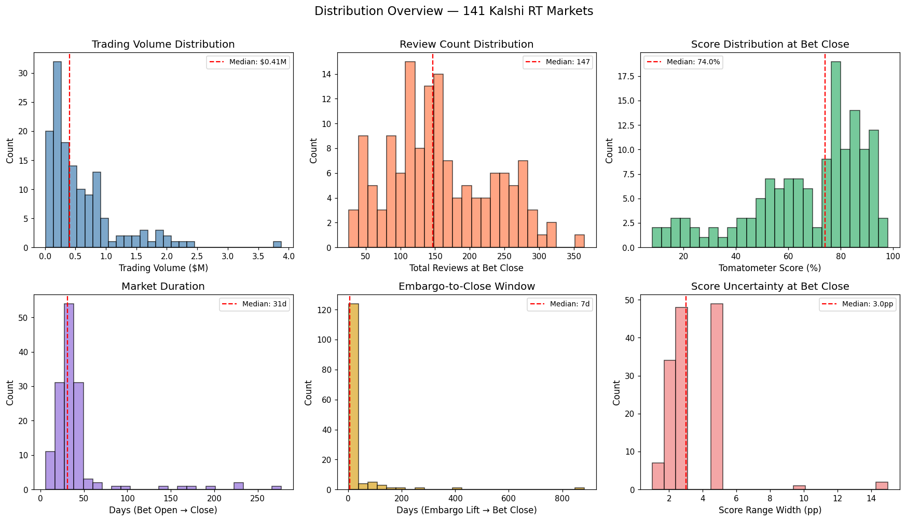
    


<div>
<style scoped>
    .dataframe tbody tr th:only-of-type {
        vertical-align: middle;
    }

    .dataframe tbody tr th {
        vertical-align: top;
    }

    .dataframe thead th {
        text-align: right;
    }
</style>
<table border="1" class="dataframe">
  <thead>
    <tr style="text-align: right;">
      <th></th>
      <th>Volume ($)</th>
      <th>Reviews</th>
      <th>Score (%)</th>
      <th>Duration (d)</th>
      <th>Embargo→Close (d)</th>
      <th>Score Width (pp)</th>
    </tr>
  </thead>
  <tbody>
    <tr>
      <th>count</th>
      <td>141.0</td>
      <td>140.0</td>
      <td>141.0</td>
      <td>141.0</td>
      <td>141.0</td>
      <td>141.0</td>
    </tr>
    <tr>
      <th>mean</th>
      <td>599524.7</td>
      <td>157.6</td>
      <td>67.2</td>
      <td>41.0</td>
      <td>29.9</td>
      <td>3.6</td>
    </tr>
    <tr>
      <th>std</th>
      <td>596059.8</td>
      <td>75.5</td>
      <td>22.3</td>
      <td>39.8</td>
      <td>87.9</td>
      <td>2.0</td>
    </tr>
    <tr>
      <th>min</th>
      <td>11059.0</td>
      <td>26.0</td>
      <td>8.0</td>
      <td>6.0</td>
      <td>3.0</td>
      <td>1.0</td>
    </tr>
    <tr>
      <th>25%</th>
      <td>183819.0</td>
      <td>108.8</td>
      <td>53.0</td>
      <td>27.0</td>
      <td>5.0</td>
      <td>2.0</td>
    </tr>
    <tr>
      <th>50%</th>
      <td>405018.0</td>
      <td>147.0</td>
      <td>74.0</td>
      <td>31.0</td>
      <td>7.0</td>
      <td>3.0</td>
    </tr>
    <tr>
      <th>75%</th>
      <td>806207.0</td>
      <td>216.1</td>
      <td>84.0</td>
      <td>40.0</td>
      <td>17.0</td>
      <td>5.0</td>
    </tr>
    <tr>
      <th>max</th>
      <td>3877201.0</td>
      <td>365.0</td>
      <td>98.0</td>
      <td>277.0</td>
      <td>883.0</td>
      <td>15.0</td>
    </tr>
  </tbody>
</table>
</div>


## 3. Trading Volume vs. Review Count

Is there structure? If volume correlates with review count, we can estimate a review ceiling from early trading activity (Backlog §2.10).


```python
fig, axes = plt.subplots(1, 3, figsize=(18, 5.5))

# ── Volume vs Reviews ──
ax = axes[0]
ax.scatter(mi['reviews_mid'], mi['volume'] / 1e6, alpha=0.5, s=30, c='steelblue', edgecolor='k', linewidth=0.3)
ax.set_xlabel('Total Reviews at Bet Close')
ax.set_ylabel('Trading Volume ($M)')
ax.set_title('Trading Volume vs. Review Count')

# Correlation
from scipy import stats
r, p = stats.pearsonr(mi['reviews_mid'], mi['volume'])
rs, ps = stats.spearmanr(mi['reviews_mid'], mi['volume'])
ax.annotate(f'Pearson r={r:.2f} (p={p:.1e})\nSpearman ρ={rs:.2f} (p={ps:.1e})', 
            xy=(0.03, 0.97), xycoords='axes fraction', va='top', fontsize=9,
            bbox=dict(boxstyle='round', fc='wheat', alpha=0.7))

# ── Volume vs Score (does controversial = more trading?) ──
ax = axes[1]
ax.scatter(mi['score_mid_pct'], mi['volume'] / 1e6, alpha=0.5, s=30, c='coral', edgecolor='k', linewidth=0.3)
ax.set_xlabel('Tomatometer Score (%)')
ax.set_ylabel('Trading Volume ($M)')
ax.set_title('Trading Volume vs. Score')
r2, p2 = stats.pearsonr(mi['score_mid_pct'], mi['volume'])
ax.annotate(f'Pearson r={r2:.2f} (p={p2:.1e})', 
            xy=(0.03, 0.97), xycoords='axes fraction', va='top', fontsize=9,
            bbox=dict(boxstyle='round', fc='wheat', alpha=0.7))

# ── Reviews vs Score ──
ax = axes[2]
ax.scatter(mi['score_mid_pct'], mi['reviews_mid'], alpha=0.5, s=30, c='mediumseagreen', edgecolor='k', linewidth=0.3)
ax.set_xlabel('Tomatometer Score (%)')
ax.set_ylabel('Total Reviews')
ax.set_title('Review Count vs. Score')
r3, p3 = stats.pearsonr(mi['score_mid_pct'], mi['reviews_mid'])
ax.annotate(f'Pearson r={r3:.2f} (p={p3:.1e})', 
            xy=(0.03, 0.97), xycoords='axes fraction', va='top', fontsize=9,
            bbox=dict(boxstyle='round', fc='wheat', alpha=0.7))

plt.tight_layout()
plt.show()

# ── Log-scale volume vs reviews to check for multiplicative relationship ──
fig, ax = plt.subplots(figsize=(8, 5))
ax.scatter(mi['reviews_mid'], mi['volume'] / 1e6, alpha=0.5, s=30, c='steelblue', edgecolor='k', linewidth=0.3)
ax.set_xlabel('Total Reviews at Bet Close')
ax.set_ylabel('Trading Volume ($M)')
ax.set_title('Volume vs. Reviews (log-log)')
ax.set_xscale('log')
ax.set_yscale('log')

# Fit log-log regression
logr, logv = np.log(mi['reviews_mid']), np.log(mi['volume'])
slope, intercept, r_val, p_val, _ = stats.linregress(logr, logv)
x_fit = np.linspace(logr.min(), logr.max(), 100)
ax.plot(np.exp(x_fit), np.exp(intercept + slope * x_fit) / 1e6, 'r--', alpha=0.7,
        label=f'log-log fit: slope={slope:.2f}, R²={r_val**2:.2f}')
ax.legend(fontsize=9)
plt.tight_layout()
plt.show()
```


    
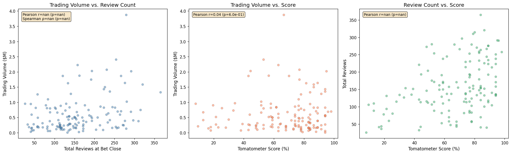
    


    
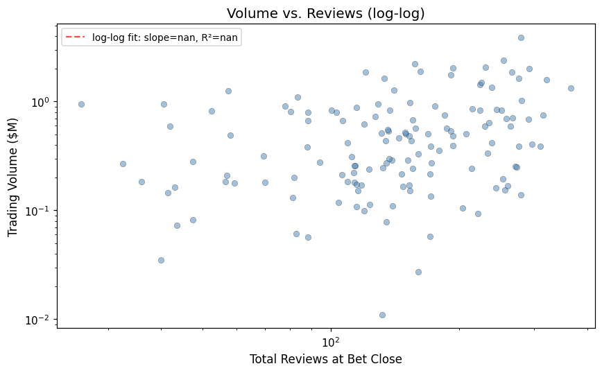
    


## 4. Boundary Misprice Analysis

For each movie: identify the Kalshi threshold(s) closest to the actual score, then check what the market was pricing in the last 24h before close. A "clear misprice" = market confident (>70¢ or <30¢) on the wrong side of a threshold that the score range unambiguously resolves.

Resolution rule: "Above X" resolves Yes if displayed Tomatometer >= X+1 (i.e., strictly > X).


```python
def get_threshold_value(col_name):
    """Extract numeric threshold from column name like 'Above 85' → 85."""
    return int(col_name.split()[-1])

def resolve_threshold(threshold_val, score_low_pct, score_high_pct):
    """
    Determine if "Above {threshold_val}" resolves Yes, No, or Ambiguous.
    "Above X" resolves Yes if displayed score >= X+1.
    RT uses standard rounding (round half up), so displayed = round(actual).
    
    score_low_pct/score_high_pct are the Tomatometer range as percentages (e.g., 87.50, 90.50).
    """
    # Displayed score range (standard rounding)
    displayed_low = round(score_low_pct)
    displayed_high = round(score_high_pct)
    
    needed = threshold_val + 1  # displayed score must be >= this to resolve Yes
    
    if displayed_low >= needed:
        return 'Yes'  # resolves Yes for all scores in range
    elif displayed_high < needed:
        return 'No'   # resolves No for all scores in range
    else:
        return 'Ambiguous'  # depends on where in range the actual score falls

# For each movie, get last-24h pricing for each threshold and check against resolution
misprice_records = []

for _, row in mi.iterrows():
    slug = row['Slug']
    if slug not in price_data:
        continue
    
    prices = price_data[slug]
    bet_close = row['Bet Close Date']
    
    # Last 24h before bet close
    window_start = bet_close - pd.Timedelta(hours=24)
    last_24h = prices.loc[window_start:bet_close]
    
    if last_24h.empty:
        # Try wider window
        last_24h = prices.iloc[-24:]  # last 24 rows as fallback
    
    for col in threshold_cols.get(slug, []):
        thresh_val = get_threshold_value(col)
        resolution = resolve_threshold(thresh_val, row['score_low_pct'], row['score_high_pct'])
        
        # Get prices in last 24h for this threshold (drop NaN = no trading activity)
        col_prices = last_24h[col].dropna()
        if col_prices.empty:
            continue
        
        avg_price = col_prices.mean()
        last_price = col_prices.iloc[-1]
        
        # Determine if mispriced
        if resolution == 'Yes':
            # Should price near 100. Misprice if market prices < 70
            edge = 100 - avg_price  # what you'd earn buying Yes at avg_price
            is_mispriced = avg_price < 70
        elif resolution == 'No':
            # Should price near 0. Misprice if market prices > 30
            edge = avg_price  # what you'd earn selling (buying No) at avg_price
            is_mispriced = avg_price > 30
        else:
            edge = np.nan
            is_mispriced = False
        
        misprice_records.append({
            'slug': slug,
            'threshold': thresh_val,
            'resolution': resolution,
            'avg_price_24h': avg_price,
            'last_price': last_price,
            'edge_cents': edge if resolution != 'Ambiguous' else np.nan,
            'is_mispriced': is_mispriced,
            'volume': row['volume'],
            'score_mid_pct': row['score_mid_pct'],
            'n_price_obs': len(col_prices),
        })

mp = pd.DataFrame(misprice_records)
print(f"Total threshold-movie pairs with last-24h pricing: {len(mp)}")
print(f"Unambiguous resolutions: {(mp['resolution'] != 'Ambiguous').sum()}")
print(f"Clear misprices (>30¢ on wrong side): {mp['is_mispriced'].sum()}")
print(f"\nResolution breakdown:")
print(mp['resolution'].value_counts())
```

    Total threshold-movie pairs with last-24h pricing: 1588
    Unambiguous resolutions: 1445
    Clear misprices (>30¢ on wrong side): 25
    
    Resolution breakdown:
    resolution
    No           726
    Yes          719
    Ambiguous    143
    Name: count, dtype: int64


```python
# ── Visualize: market price vs. resolution for unambiguous cases ──
unamb = mp[mp['resolution'] != 'Ambiguous'].copy()
unamb['correct_side'] = np.where(
    unamb['resolution'] == 'Yes',
    unamb['avg_price_24h'],        # higher = more correct
    100 - unamb['avg_price_24h']   # lower price = more correct for No resolution
)

fig, axes = plt.subplots(1, 3, figsize=(18, 5.5))

# 1. Distribution of last-24h avg price by resolution
ax = axes[0]
for res, color in [('Yes', 'mediumseagreen'), ('No', 'tomato')]:
    subset = unamb[unamb['resolution'] == res]
    ax.hist(subset['avg_price_24h'], bins=25, alpha=0.6, color=color, 
            edgecolor='black', label=f'Resolved {res} (n={len(subset)})')
ax.set_xlabel('Avg Market Price (¢) in Last 24h')
ax.set_ylabel('Count')
ax.set_title('Market Price Distribution by Resolution')
ax.legend()
ax.axvline(50, color='gray', ls=':', alpha=0.5)

# 2. Edge distribution for mispriced cases
ax = axes[1]
mispriced = unamb[unamb['is_mispriced']].copy()
if not mispriced.empty:
    ax.hist(mispriced['edge_cents'], bins=20, edgecolor='black', alpha=0.7, color='gold')
    ax.set_xlabel('Edge (¢) — Profit per Contract')
    ax.set_ylabel('Count')
    ax.set_title(f'Edge Distribution — {len(mispriced)} Mispriced Thresholds')
    ax.axvline(mispriced['edge_cents'].median(), color='red', ls='--', 
               label=f"Median edge: {mispriced['edge_cents'].median():.0f}¢")
    ax.legend()
else:
    ax.text(0.5, 0.5, 'No clear misprices found', ha='center', va='center', transform=ax.transAxes)
    ax.set_title('Edge Distribution')

# 3. Edge vs. volume — do misprices concentrate in low-volume markets?
ax = axes[2]
if not mispriced.empty:
    ax.scatter(mispriced['volume'] / 1e6, mispriced['edge_cents'], 
               alpha=0.6, s=40, c='gold', edgecolor='k', linewidth=0.3)
    ax.set_xlabel('Trading Volume ($M)')
    ax.set_ylabel('Edge (¢)')
    ax.set_title('Edge vs. Market Volume')
    r_edge, p_edge = stats.spearmanr(mispriced['volume'], mispriced['edge_cents'])
    ax.annotate(f'Spearman ρ={r_edge:.2f} (p={p_edge:.2e})', 
                xy=(0.03, 0.97), xycoords='axes fraction', va='top', fontsize=9,
                bbox=dict(boxstyle='round', fc='wheat', alpha=0.7))

plt.tight_layout()
plt.show()

# ── Table: biggest misprices ──
if not mispriced.empty:
    print(f"\n{'='*80}")
    print(f"TOP 20 MISPRICED THRESHOLDS (last 24h before close)")
    print(f"{'='*80}")
    top_misprices = mispriced.nlargest(20, 'edge_cents')[
        ['slug', 'threshold', 'resolution', 'avg_price_24h', 'last_price', 'edge_cents', 'volume']
    ].copy()
    top_misprices['volume'] = top_misprices['volume'].apply(lambda x: f"${x/1e6:.2f}M")
    top_misprices['avg_price_24h'] = top_misprices['avg_price_24h'].round(1)
    top_misprices['last_price'] = top_misprices['last_price'].round(1)
    top_misprices['edge_cents'] = top_misprices['edge_cents'].round(1)
    display(top_misprices.reset_index(drop=True))
```


    
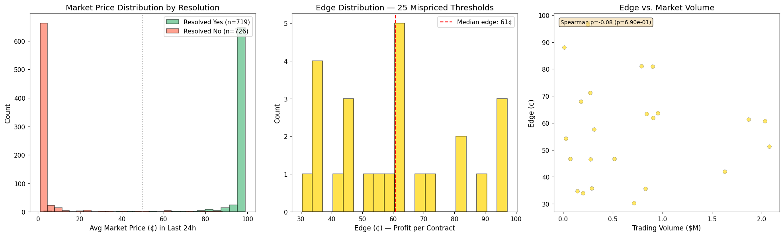
    


    
    ================================================================================
    TOP 20 MISPRICED THRESHOLDS (last 24h before close)
    ================================================================================


<div>
<style scoped>
    .dataframe tbody tr th:only-of-type {
        vertical-align: middle;
    }

    .dataframe tbody tr th {
        vertical-align: top;
    }

    .dataframe thead th {
        text-align: right;
    }
</style>
<table border="1" class="dataframe">
  <thead>
    <tr style="text-align: right;">
      <th></th>
      <th>slug</th>
      <th>threshold</th>
      <th>resolution</th>
      <th>avg_price_24h</th>
      <th>last_price</th>
      <th>edge_cents</th>
      <th>volume</th>
    </tr>
  </thead>
  <tbody>
    <tr>
      <th>0</th>
      <td>joker_folie_a_deux</td>
      <td>35</td>
      <td>Yes</td>
      <td>2.8</td>
      <td>5.1</td>
      <td>97.2</td>
      <td>$0.25M</td>
    </tr>
    <tr>
      <th>1</th>
      <td>joker_folie_a_deux</td>
      <td>45</td>
      <td>Yes</td>
      <td>3.4</td>
      <td>1.0</td>
      <td>96.6</td>
      <td>$0.25M</td>
    </tr>
    <tr>
      <th>2</th>
      <td>joker_folie_a_deux</td>
      <td>40</td>
      <td>Yes</td>
      <td>3.5</td>
      <td>1.7</td>
      <td>96.5</td>
      <td>$0.25M</td>
    </tr>
    <tr>
      <th>3</th>
      <td>the_wild_robot</td>
      <td>97</td>
      <td>No</td>
      <td>88.0</td>
      <td>94.1</td>
      <td>88.0</td>
      <td>$0.01M</td>
    </tr>
    <tr>
      <th>4</th>
      <td>heart_eyes</td>
      <td>80</td>
      <td>No</td>
      <td>81.1</td>
      <td>75.1</td>
      <td>81.1</td>
      <td>$0.79M</td>
    </tr>
    <tr>
      <th>5</th>
      <td>wolf_man_2025</td>
      <td>52</td>
      <td>No</td>
      <td>81.0</td>
      <td>89.4</td>
      <td>81.0</td>
      <td>$0.90M</td>
    </tr>
    <tr>
      <th>6</th>
      <td>springsteen_deliver_me_from_nowhere</td>
      <td>60</td>
      <td>No</td>
      <td>71.1</td>
      <td>61.5</td>
      <td>71.1</td>
      <td>$0.27M</td>
    </tr>
    <tr>
      <th>7</th>
      <td>rental_family</td>
      <td>87</td>
      <td>Yes</td>
      <td>32.0</td>
      <td>11.0</td>
      <td>68.0</td>
      <td>$0.18M</td>
    </tr>
    <tr>
      <th>8</th>
      <td>melania</td>
      <td>10</td>
      <td>No</td>
      <td>63.6</td>
      <td>34.9</td>
      <td>63.6</td>
      <td>$0.95M</td>
    </tr>
    <tr>
      <th>9</th>
      <td>wuthering_heights_2026</td>
      <td>62</td>
      <td>No</td>
      <td>63.3</td>
      <td>41.6</td>
      <td>63.3</td>
      <td>$0.84M</td>
    </tr>
    <tr>
      <th>10</th>
      <td>smurfs</td>
      <td>20</td>
      <td>No</td>
      <td>61.9</td>
      <td>74.7</td>
      <td>61.9</td>
      <td>$0.91M</td>
    </tr>
    <tr>
      <th>11</th>
      <td>a_minecraft_movie</td>
      <td>48</td>
      <td>No</td>
      <td>61.4</td>
      <td>38.4</td>
      <td>61.4</td>
      <td>$1.87M</td>
    </tr>
    <tr>
      <th>12</th>
      <td>disneys_snow_white</td>
      <td>43</td>
      <td>Yes</td>
      <td>39.3</td>
      <td>70.1</td>
      <td>60.7</td>
      <td>$2.03M</td>
    </tr>
    <tr>
      <th>13</th>
      <td>how_to_make_a_killing_2026</td>
      <td>47</td>
      <td>Yes</td>
      <td>42.4</td>
      <td>72.1</td>
      <td>57.6</td>
      <td>$0.31M</td>
    </tr>
    <tr>
      <th>14</th>
      <td>the_apprentice</td>
      <td>77</td>
      <td>Yes</td>
      <td>45.8</td>
      <td>68.0</td>
      <td>54.2</td>
      <td>$0.03M</td>
    </tr>
    <tr>
      <th>15</th>
      <td>mickey_17</td>
      <td>78</td>
      <td>No</td>
      <td>51.3</td>
      <td>4.5</td>
      <td>51.3</td>
      <td>$2.08M</td>
    </tr>
    <tr>
      <th>16</th>
      <td>sarahs_oil</td>
      <td>75</td>
      <td>Yes</td>
      <td>53.3</td>
      <td>39.0</td>
      <td>46.7</td>
      <td>$0.07M</td>
    </tr>
    <tr>
      <th>17</th>
      <td>the_conjuring_last_rites</td>
      <td>55</td>
      <td>Yes</td>
      <td>53.4</td>
      <td>66.7</td>
      <td>46.6</td>
      <td>$0.52M</td>
    </tr>
    <tr>
      <th>18</th>
      <td>ella_mccay</td>
      <td>22</td>
      <td>No</td>
      <td>46.5</td>
      <td>14.6</td>
      <td>46.5</td>
      <td>$0.28M</td>
    </tr>
    <tr>
      <th>19</th>
      <td>novocaine_2025</td>
      <td>82</td>
      <td>No</td>
      <td>42.0</td>
      <td>28.0</td>
      <td>42.0</td>
      <td>$1.63M</td>
    </tr>
  </tbody>
</table>
</div>


```python
# ── Per-movie summary: how many movies had at least one mispriced threshold? ──
if not mispriced.empty:
    movies_mispriced = mispriced.groupby('slug').agg(
        n_mispriced_thresholds=('edge_cents', 'count'),
        max_edge=('edge_cents', 'max'),
        avg_edge=('edge_cents', 'mean'),
        volume=('volume', 'first'),
    ).sort_values('max_edge', ascending=False)
    
    print(f"Movies with at least one mispriced threshold: {len(movies_mispriced)} / {len(mi)}")
    print(f"Movies with edge > 50¢: {(movies_mispriced['max_edge'] > 50).sum()}")
    print(f"Movies with edge > 20¢: {(movies_mispriced['max_edge'] > 20).sum()}")
    print(f"\nMedian max edge per movie: {movies_mispriced['max_edge'].median():.1f}¢")
    
    # How much of the misprice opportunity is in low-volume markets?
    vol_median = mi['volume'].median()
    low_vol = movies_mispriced[movies_mispriced['volume'] < vol_median]
    high_vol = movies_mispriced[movies_mispriced['volume'] >= vol_median]
    print(f"\nLow-volume markets (<${vol_median/1e6:.2f}M): "
          f"{len(low_vol)} movies, median max edge {low_vol['max_edge'].median():.1f}¢")
    print(f"High-volume markets (>=${vol_median/1e6:.2f}M): "
          f"{len(high_vol)} movies, median max edge {high_vol['max_edge'].median():.1f}¢")
```

    Movies with at least one mispriced threshold: 23 / 141
    Movies with edge > 50¢: 14
    Movies with edge > 20¢: 23
    
    Median max edge per movie: 57.6¢
    
    Low-volume markets (<$0.41M): 11 movies, median max edge 54.2¢
    High-volume markets (>=$0.41M): 12 movies, median max edge 61.0¢


## 5. Additional Patterns

### 5a. When did reviews arrive relative to market close?
How concentrated is the review arrival window? If most reviews arrive well before close, the score is "knowable" early.


```python
# For each review, compute hours before bet close
reviews_with_close = reviews.merge(
    mi[['Slug', 'Bet Close Date']].rename(columns={'Slug': 'movie_slug'}),
    on='movie_slug', how='inner'
)
reviews_with_close['hours_before_close'] = (
    (reviews_with_close['Bet Close Date'] - reviews_with_close['estimated_timestamp'])
    .dt.total_seconds() / 3600
)

fig, axes = plt.subplots(1, 3, figsize=(18, 5))

# 1. Distribution of review arrival time relative to close
ax = axes[0]
valid = reviews_with_close['hours_before_close'].between(-24, 500)
ax.hist(reviews_with_close.loc[valid, 'hours_before_close'] / 24, bins=50, 
        edgecolor='black', alpha=0.7, color='steelblue')
ax.set_xlabel('Days Before Bet Close')
ax.set_ylabel('Review Count')
ax.set_title('Review Arrival Timing (relative to close)')
ax.axvline(1, color='red', ls='--', alpha=0.7, label='24h before close')
ax.axvline(2, color='orange', ls='--', alpha=0.7, label='48h before close')
ax.legend(fontsize=9)

# 2. What fraction of reviews are in by 24h / 48h / 72h before close?
ax = axes[1]
thresholds_h = [6, 12, 24, 48, 72, 120, 168]
per_movie_pcts = []
for slug in mi['Slug']:
    movie_revs = reviews_with_close[reviews_with_close['movie_slug'] == slug]
    total = len(movie_revs)
    if total == 0:
        continue
    for h in thresholds_h:
        pct = (movie_revs['hours_before_close'] >= h).sum() / total * 100
        per_movie_pcts.append({'slug': slug, 'hours_before': h, 'pct_arrived': 100 - pct})

pct_df = pd.DataFrame(per_movie_pcts)
pct_summary = pct_df.groupby('hours_before')['pct_arrived'].agg(['mean', 'median', 'std']).reset_index()
ax.bar([f'{h}h' for h in thresholds_h], pct_summary['median'], 
       yerr=pct_summary['std'], color='coral', edgecolor='black', alpha=0.7, capsize=4)
ax.set_xlabel('Hours Before Close')
ax.set_ylabel('% of Reviews Arrived (median)')
ax.set_title('Review Completeness by Time Before Close')
ax.set_ylim(0, 105)
for i, (_, row) in enumerate(pct_summary.iterrows()):
    ax.text(i, row['median'] + row['std'] + 2, f"{row['median']:.0f}%", ha='center', fontsize=8)

# 3. Per-movie: reviews arriving in last 24h
ax = axes[2]
last_24h_counts = []
for slug in mi['Slug']:
    movie_revs = reviews_with_close[reviews_with_close['movie_slug'] == slug]
    total = len(movie_revs)
    in_last_24h = (movie_revs['hours_before_close'] < 24).sum()
    last_24h_counts.append({'slug': slug, 'total': total, 'last_24h': in_last_24h,
                            'pct_last_24h': in_last_24h / total * 100 if total > 0 else 0})
last_24h_df = pd.DataFrame(last_24h_counts)
ax.hist(last_24h_df['pct_last_24h'], bins=25, edgecolor='black', alpha=0.7, color='mediumpurple')
ax.set_xlabel('% of Reviews in Last 24h')
ax.set_ylabel('Movies')
ax.set_title('Late-Arriving Review Concentration')
ax.axvline(last_24h_df['pct_last_24h'].median(), color='red', ls='--',
           label=f"Median: {last_24h_df['pct_last_24h'].median():.1f}%")
ax.legend(fontsize=9)

plt.tight_layout()
plt.show()

print(f"Median reviews in last 24h: {last_24h_df['last_24h'].median():.0f} "
      f"({last_24h_df['pct_last_24h'].median():.1f}% of total)")
print(f"Movies with >20% of reviews in last 24h: {(last_24h_df['pct_last_24h'] > 20).sum()}")
print(f"Movies with >30% of reviews in last 24h: {(last_24h_df['pct_last_24h'] > 30).sum()}")
```


    
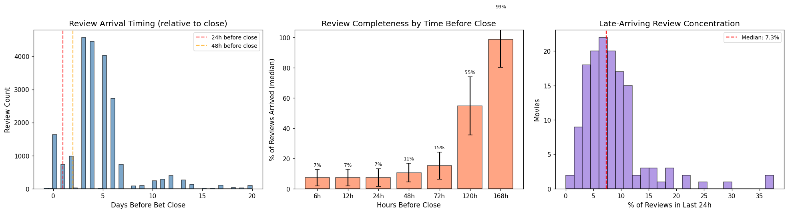
    


    Median reviews in last 24h: 11 (7.3% of total)
    Movies with >20% of reviews in last 24h: 6
    Movies with >30% of reviews in last 24h: 2


### 5b. Top-critic vs. all-critic fresh rates

If top critics skew differently than the full pool, early top-critic-only signals (embargo lifts usually have top critics first) could be systematically biased.


```python
# Per-movie: top-critic fresh rate vs. all-critic fresh rate
tc_rates = reviews.groupby(['movie_slug', 'top_critic'])['is_fresh'].agg(['mean', 'count']).reset_index()
tc_pivot = tc_rates.pivot(index='movie_slug', columns='top_critic', values='mean')
tc_count_pivot = tc_rates.pivot(index='movie_slug', columns='top_critic', values='count')

# Only keep movies with >= 10 top critics and >= 10 non-top critics
has_both = (tc_count_pivot[True] >= 10) & (tc_count_pivot[False] >= 10)
tc_compare = tc_pivot[has_both].dropna()

fig, axes = plt.subplots(1, 2, figsize=(14, 5.5))

# Scatter: top-critic rate vs all-critic rate
ax = axes[0]
ax.scatter(tc_compare[False] * 100, tc_compare[True] * 100, alpha=0.5, s=30, 
           c='steelblue', edgecolor='k', linewidth=0.3)
ax.plot([0, 100], [0, 100], 'r--', alpha=0.5, label='y=x (perfect agreement)')
ax.set_xlabel('Non-Top-Critic Fresh Rate (%)')
ax.set_ylabel('Top-Critic Fresh Rate (%)')
ax.set_title(f'Top vs. Non-Top Critic Fresh Rates (n={len(tc_compare)} movies)')
ax.legend(fontsize=9)
ax.set_xlim(0, 100)
ax.set_ylim(0, 100)

# Difference distribution
ax = axes[1]
diff = (tc_compare[True] - tc_compare[False]) * 100
ax.hist(diff, bins=25, edgecolor='black', alpha=0.7, color='coral')
ax.set_xlabel('Top-Critic Rate − Non-Top-Critic Rate (pp)')
ax.set_ylabel('Movies')
ax.set_title('Top-Critic Freshness Bias')
ax.axvline(0, color='gray', ls=':', alpha=0.5)
ax.axvline(diff.median(), color='red', ls='--', label=f'Median: {diff.median():.1f}pp')
ax.legend(fontsize=9)

plt.tight_layout()
plt.show()

print(f"Movies in comparison: {len(tc_compare)}")
print(f"Median top-critic bias: {diff.median():.1f}pp")
print(f"Mean top-critic bias: {diff.mean():.1f}pp")
print(f"Movies where top critics are >5pp more positive: {(diff > 5).sum()}")
print(f"Movies where top critics are >5pp more negative: {(diff < -5).sum()}")
```


    
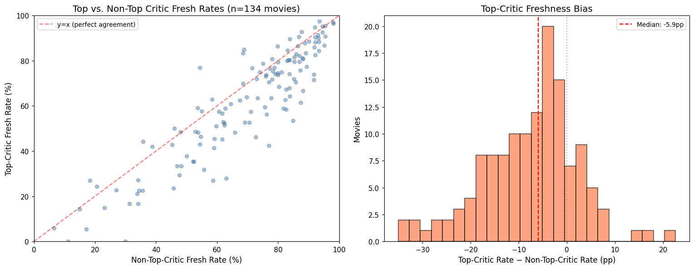
    


    Movies in comparison: 134
    Median top-critic bias: -5.9pp
    Mean top-critic bias: -7.6pp
    Movies where top critics are >5pp more positive: 10
    Movies where top critics are >5pp more negative: 73


### 5c. Price activity as market attention proxy

Minute-level row counts in price CSVs approximate trading activity. How does this relate to volume and score proximity to thresholds?


```python
# Load minute-level row counts as activity proxy
activity = []
for slug in mi['Slug']:
    d = ROOT / 'rt-price-histories' / slug
    minute_files = list(d.glob('*-minute.csv'))
    if minute_files:
        n_rows = sum(1 for _ in open(minute_files[0])) - 1  # subtract header
        activity.append({'slug': slug, 'minute_rows': n_rows})

act_df = pd.DataFrame(activity)
mi_act = mi.merge(act_df, left_on='Slug', right_on='slug', how='inner')

# Distance from nearest common threshold (45, 60, 70, 75, 80, 82, 85, 87, 90, 92, 95)
common_thresholds = np.array([45, 60, 70, 75, 80, 82, 85, 87, 90, 92, 95])
mi_act['dist_to_nearest_threshold'] = mi_act['score_mid_pct'].apply(
    lambda s: np.min(np.abs(common_thresholds - s))
)

fig, axes = plt.subplots(1, 3, figsize=(18, 5))

# 1. Minute rows vs volume
ax = axes[0]
ax.scatter(mi_act['minute_rows'], mi_act['volume'] / 1e6, alpha=0.5, s=30, c='steelblue', edgecolor='k', linewidth=0.3)
ax.set_xlabel('Minute-Level Price Rows')
ax.set_ylabel('Trading Volume ($M)')
ax.set_title('Price Activity vs. Volume')
r_a, p_a = stats.spearmanr(mi_act['minute_rows'], mi_act['volume'])
ax.annotate(f'Spearman ρ={r_a:.2f} (p={p_a:.1e})', xy=(0.03, 0.97), xycoords='axes fraction', va='top', fontsize=9,
            bbox=dict(boxstyle='round', fc='wheat', alpha=0.7))

# 2. Volume vs distance to nearest threshold
ax = axes[1]
ax.scatter(mi_act['dist_to_nearest_threshold'], mi_act['volume'] / 1e6, alpha=0.5, s=30, c='coral', edgecolor='k', linewidth=0.3)
ax.set_xlabel('Score Distance to Nearest Threshold (pp)')
ax.set_ylabel('Trading Volume ($M)')
ax.set_title('Volume vs. Score Proximity to Threshold')
r_d, p_d = stats.spearmanr(mi_act['dist_to_nearest_threshold'], mi_act['volume'])
ax.annotate(f'Spearman ρ={r_d:.2f} (p={p_d:.1e})', xy=(0.03, 0.97), xycoords='axes fraction', va='top', fontsize=9,
            bbox=dict(boxstyle='round', fc='wheat', alpha=0.7))

# 3. Activity (minute rows) vs reviews
ax = axes[2]
mi_act2 = mi_act.merge(rev_counts[['movie_slug', 'n_reviews']], left_on='Slug', right_on='movie_slug', how='inner')
ax.scatter(mi_act2['n_reviews'], mi_act2['minute_rows'], alpha=0.5, s=30, c='mediumseagreen', edgecolor='k', linewidth=0.3)
ax.set_xlabel('Total Reviews (from DB)')
ax.set_ylabel('Minute-Level Price Rows')
ax.set_title('Price Activity vs. Review Count')
r_ar, p_ar = stats.spearmanr(mi_act2['n_reviews'], mi_act2['minute_rows'])
ax.annotate(f'Spearman ρ={r_ar:.2f} (p={p_ar:.1e})', xy=(0.03, 0.97), xycoords='axes fraction', va='top', fontsize=9,
            bbox=dict(boxstyle='round', fc='wheat', alpha=0.7))

plt.tight_layout()
plt.show()
```


    
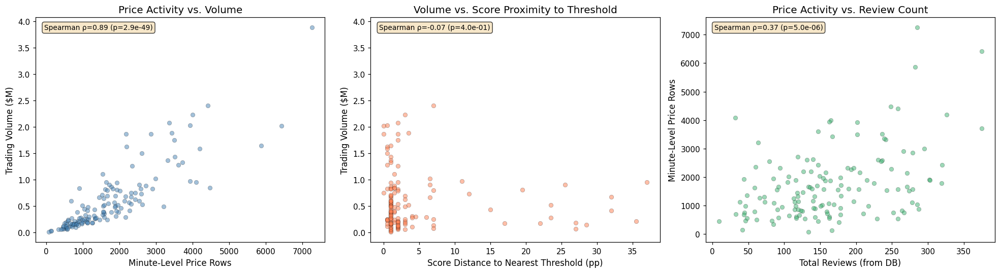
    


### 5d. Score stability — how much does the score swing in the final days?

For the 4 live-tracked movies with minute-level review timestamps, trace the actual score over time. For all movies, look at the score range width as a function of review count — does more data reduce uncertainty as expected?


```python
# Score range width vs review count — does more data = tighter range?
fig, axes = plt.subplots(1, 2, figsize=(14, 5))

ax = axes[0]
ax.scatter(mi['reviews_mid'], mi['score_range_width_pct'], alpha=0.5, s=30, c='steelblue', edgecolor='k', linewidth=0.3)
ax.set_xlabel('Total Reviews at Bet Close')
ax.set_ylabel('Score Range Width (pp)')
ax.set_title('Score Uncertainty vs. Review Count')
r_su, p_su = stats.spearmanr(mi['reviews_mid'], mi['score_range_width_pct'])
ax.annotate(f'Spearman ρ={r_su:.2f} (p={p_su:.1e})', xy=(0.03, 0.97), xycoords='axes fraction', va='top', fontsize=9,
            bbox=dict(boxstyle='round', fc='wheat', alpha=0.7))

# Score trajectory for live-tracked movies (minute-level timestamp confidence)
ax = axes[1]
live_tracked = ['project_hail_mary', 'ready_or_not_2_here_i_come', 'forbidden_fruits_2026', 'they_will_kill_you']
colors_live = ['steelblue', 'coral', 'mediumseagreen', 'mediumpurple']

for slug, color in zip(live_tracked, colors_live):
    movie_revs = reviews[reviews['movie_slug'] == slug].sort_values('estimated_timestamp')
    if movie_revs.empty:
        continue
    # Running tomatometer score
    movie_revs = movie_revs.copy()
    movie_revs['cumulative_fresh'] = movie_revs['is_fresh'].cumsum()
    movie_revs['cumulative_total'] = range(1, len(movie_revs) + 1)
    movie_revs['running_score'] = movie_revs['cumulative_fresh'] / movie_revs['cumulative_total'] * 100
    
    ax.plot(movie_revs['cumulative_total'], movie_revs['running_score'], 
            alpha=0.7, linewidth=1.5, color=color, label=slug.replace('_', ' ').title()[:25])

ax.set_xlabel('Cumulative Review Count')
ax.set_ylabel('Running Tomatometer Score (%)')
ax.set_title('Score Trajectory — Live-Tracked Movies')
ax.legend(fontsize=8, loc='best')
ax.set_ylim(0, 100)
ax.axhspan(85, 90, alpha=0.1, color='red', label='Common thresholds')

plt.tight_layout()
plt.show()
```


    
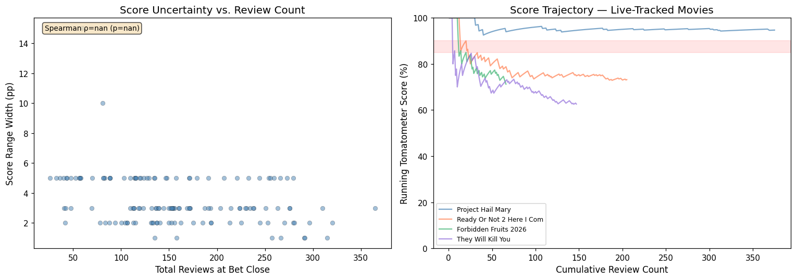
    


### 5e. Market temporal patterns

When do markets open relative to embargo lift? How does price evolve from open → embargo → close?


```python
# When do markets open relative to embargo lift?
mi['open_to_embargo_days'] = (mi['Embargo Lift Date'] - mi['Bet Open Date']).dt.days

fig, axes = plt.subplots(1, 3, figsize=(18, 5))

# 1. Bet open → embargo lift
ax = axes[0]
ax.hist(mi['open_to_embargo_days'].dropna(), bins=30, edgecolor='black', alpha=0.7, color='steelblue')
ax.set_xlabel('Days (Bet Open → Embargo Lift)')
ax.set_ylabel('Movies')
ax.set_title('Pre-Review Trading Window')
ax.axvline(mi['open_to_embargo_days'].median(), color='red', ls='--', 
           label=f"Median: {mi['open_to_embargo_days'].median():.0f}d")
ax.legend(fontsize=9)
# Note: negative = embargo before market opens
neg = (mi['open_to_embargo_days'] < 0).sum()
ax.annotate(f'{neg} movies: embargo before market opens', xy=(0.03, 0.85), xycoords='axes fraction', fontsize=9,
            bbox=dict(boxstyle='round', fc='lightyellow', alpha=0.8))

# 2. Market open dates over calendar time — when did Kalshi start these?
ax = axes[1]
ax.hist(mi['Bet Open Date'].dt.to_pydatetime(), bins=30, edgecolor='black', alpha=0.7, color='coral')
ax.set_xlabel('Bet Open Date')
ax.set_ylabel('Markets')
ax.set_title('Market Launch Timeline')
ax.tick_params(axis='x', rotation=30)

# 3. Bet close dates
ax = axes[2]
ax.hist(mi['Bet Close Date'].dt.to_pydatetime(), bins=30, edgecolor='black', alpha=0.7, color='mediumseagreen')
ax.set_xlabel('Bet Close Date')
ax.set_ylabel('Markets')
ax.set_title('Market Close Timeline')
ax.tick_params(axis='x', rotation=30)

plt.tight_layout()
plt.show()

print(f"Markets with embargo BEFORE open: {neg} ({neg/len(mi)*100:.0f}%)")
print(f"Median pre-review trading window: {mi['open_to_embargo_days'].median():.0f} days")
print(f"Earliest market open: {mi['Bet Open Date'].min().date()}")
print(f"Latest market close: {mi['Bet Close Date'].max().date()}")
```


    
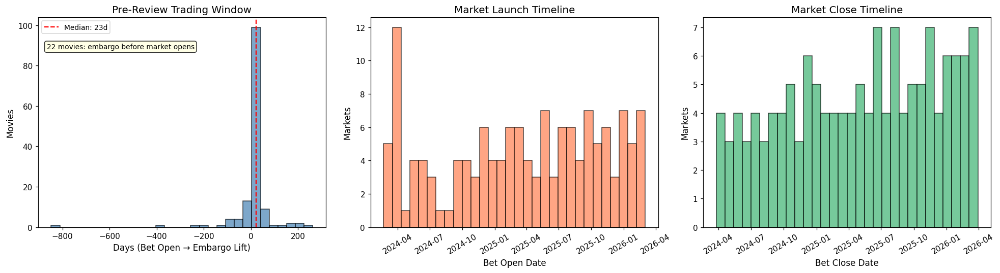
    


    Markets with embargo BEFORE open: 22 (16%)
    Median pre-review trading window: 23 days
    Earliest market open: 2024-02-22
    Latest market close: 2026-03-30


### 5f. Boundary threshold heatmap

For each movie, which thresholds had active trading and what was the final price? Shows where the "action" is across the threshold spectrum.


```python
# Build a matrix: movies × thresholds, value = last price (or NaN)
all_thresh_sorted = sorted(all_thresholds, key=lambda x: int(x.split()[-1]))
thresh_vals = [int(t.split()[-1]) for t in all_thresh_sorted]

# Sort movies by score midpoint for visual coherence
mi_sorted = mi.sort_values('score_mid_pct')

matrix = np.full((len(mi_sorted), len(thresh_vals)), np.nan)
for i, (_, row) in enumerate(mi_sorted.iterrows()):
    slug = row['Slug']
    if slug not in price_data:
        continue
    prices = price_data[slug]
    # Get last available price for each threshold
    for j, (tname, tval) in enumerate(zip(all_thresh_sorted, thresh_vals)):
        if tname in prices.columns:
            col = prices[tname].dropna()
            if not col.empty:
                matrix[i, j] = col.iloc[-1]

fig, ax = plt.subplots(figsize=(14, 20))
im = ax.imshow(matrix, aspect='auto', cmap='RdYlGn', vmin=0, vmax=100, interpolation='nearest')
ax.set_xticks(range(len(thresh_vals)))
ax.set_xticklabels([f'>{t}' for t in thresh_vals], rotation=45)
ax.set_yticks(range(len(mi_sorted)))
ax.set_yticklabels([f"{s[:20]} ({sc:.0f}%)" for s, sc in 
                     zip(mi_sorted['Slug'], mi_sorted['score_mid_pct'])], fontsize=5)
ax.set_xlabel('Threshold')
ax.set_title('Last Price by Movie × Threshold (sorted by score)')
plt.colorbar(im, ax=ax, label='Price (¢)', shrink=0.5)

# Overlay score midpoint as a marker
for i, (_, row) in enumerate(mi_sorted.iterrows()):
    # Find which threshold column is closest to score
    mid = row['score_mid_pct']
    closest_idx = np.argmin(np.abs(np.array(thresh_vals) - mid))
    ax.plot(closest_idx, i, 'kx', markersize=3, markeredgewidth=0.5)

plt.tight_layout()
plt.show()
```


    
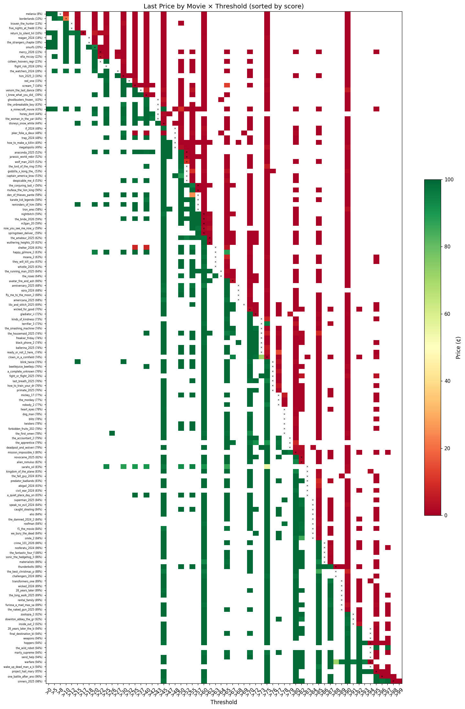
    


## 6. Volume quartile breakdown

Segment all metrics by trading volume quartile. The strategic question: is the edge concentrated in markets too thin to trade, or does it persist in liquid markets?


```python
# Volume quartiles
mi['vol_quartile'] = pd.qcut(mi['volume'], 4, labels=['Q1 (lowest)', 'Q2', 'Q3', 'Q4 (highest)'])

quartile_summary = mi.groupby('vol_quartile').agg(
    n_movies=('Slug', 'count'),
    volume_range=('volume', lambda x: f"${x.min()/1e3:.0f}K – ${x.max()/1e6:.1f}M"),
    median_reviews=('reviews_mid', 'median'),
    median_score=('score_mid_pct', 'median'),
    median_embargo_to_close=('embargo_to_close_days', 'median'),
    median_score_width=('score_range_width_pct', 'median'),
).reset_index()

# Add misprice info per quartile
if not mispriced.empty:
    mp_with_quartile = mispriced.merge(mi[['Slug', 'vol_quartile']], left_on='slug', right_on='Slug')
    misprice_by_q = mp_with_quartile.groupby('vol_quartile').agg(
        n_misprices=('edge_cents', 'count'),
        median_edge=('edge_cents', 'median'),
        max_edge=('edge_cents', 'max'),
    ).reset_index()
    quartile_summary = quartile_summary.merge(misprice_by_q, on='vol_quartile', how='left')
    quartile_summary[['n_misprices', 'median_edge', 'max_edge']] = \
        quartile_summary[['n_misprices', 'median_edge', 'max_edge']].fillna(0)

display(quartile_summary)
```


<div>
<style scoped>
    .dataframe tbody tr th:only-of-type {
        vertical-align: middle;
    }

    .dataframe tbody tr th {
        vertical-align: top;
    }

    .dataframe thead th {
        text-align: right;
    }
</style>
<table border="1" class="dataframe">
  <thead>
    <tr style="text-align: right;">
      <th></th>
      <th>vol_quartile</th>
      <th>n_movies</th>
      <th>volume_range</th>
      <th>median_reviews</th>
      <th>median_score</th>
      <th>median_embargo_to_close</th>
      <th>median_score_width</th>
      <th>n_misprices</th>
      <th>median_edge</th>
      <th>max_edge</th>
    </tr>
  </thead>
  <tbody>
    <tr>
      <th>0</th>
      <td>Q1 (lowest)</td>
      <td>36</td>
      <td>$11K – $0.2M</td>
      <td>118.0</td>
      <td>78.0</td>
      <td>11.5</td>
      <td>5.0</td>
      <td>5</td>
      <td>54.224000</td>
      <td>88.0300</td>
    </tr>
    <tr>
      <th>1</th>
      <td>Q2</td>
      <td>35</td>
      <td>$184K – $0.4M</td>
      <td>139.0</td>
      <td>74.0</td>
      <td>7.0</td>
      <td>3.0</td>
      <td>8</td>
      <td>64.350952</td>
      <td>97.2200</td>
    </tr>
    <tr>
      <th>2</th>
      <td>Q3</td>
      <td>35</td>
      <td>$415K – $0.8M</td>
      <td>152.5</td>
      <td>74.0</td>
      <td>6.0</td>
      <td>3.0</td>
      <td>3</td>
      <td>46.612083</td>
      <td>81.1080</td>
    </tr>
    <tr>
      <th>3</th>
      <td>Q4 (highest)</td>
      <td>35</td>
      <td>$817K – $3.9M</td>
      <td>191.0</td>
      <td>76.5</td>
      <td>6.0</td>
      <td>3.0</td>
      <td>9</td>
      <td>61.366500</td>
      <td>80.9845</td>
    </tr>
  </tbody>
</table>
</div>


## 7. Quick-look: biggest price swings near close

Identify movies with the largest price movement in the final 48h. These are the "interesting" markets — either late information arrival or amateur panic trading.


```python
# For each movie, find the max absolute price change in the last 48h across all thresholds
swing_records = []
for _, row in mi.iterrows():
    slug = row['Slug']
    if slug not in price_data:
        continue
    prices = price_data[slug]
    bet_close = row['Bet Close Date']
    window_start = bet_close - pd.Timedelta(hours=48)
    last_48h = prices.loc[window_start:bet_close]
    
    if len(last_48h) < 2:
        continue
    
    for col in threshold_cols.get(slug, []):
        col_data = last_48h[col].dropna()
        if len(col_data) < 2:
            continue
        # Max swing = range of prices in window
        price_range = col_data.max() - col_data.min()
        first_to_last = col_data.iloc[-1] - col_data.iloc[0]
        swing_records.append({
            'slug': slug,
            'threshold': get_threshold_value(col),
            'price_range_48h': price_range,
            'net_change_48h': first_to_last,
            'last_price': col_data.iloc[-1],
            'volume': row['volume'],
            'score_mid_pct': row['score_mid_pct'],
        })

swings = pd.DataFrame(swing_records)

# Top 20 biggest swings
top_swings = swings.nlargest(20, 'price_range_48h')[
    ['slug', 'threshold', 'price_range_48h', 'net_change_48h', 'last_price', 'volume']
].copy()
top_swings['volume'] = top_swings['volume'].apply(lambda x: f"${x/1e6:.2f}M")
top_swings['price_range_48h'] = top_swings['price_range_48h'].round(1)
top_swings['net_change_48h'] = top_swings['net_change_48h'].round(1)

print("TOP 20 PRICE SWINGS IN FINAL 48H")
print("="*80)
display(top_swings.reset_index(drop=True))

# Distribution of all swings
fig, ax = plt.subplots(figsize=(10, 4))
ax.hist(swings['price_range_48h'], bins=40, edgecolor='black', alpha=0.7, color='steelblue')
ax.set_xlabel('Price Range in Last 48h (¢)')
ax.set_ylabel('Count')
ax.set_title('Distribution of Final-48h Price Swings (all movies × thresholds)')
ax.axvline(swings['price_range_48h'].median(), color='red', ls='--',
           label=f"Median: {swings['price_range_48h'].median():.1f}¢")
ax.axvline(swings['price_range_48h'].quantile(0.9), color='orange', ls='--',
           label=f"P90: {swings['price_range_48h'].quantile(0.9):.1f}¢")
ax.legend(fontsize=9)
plt.tight_layout()
plt.show()
```

    TOP 20 PRICE SWINGS IN FINAL 48H
    ================================================================================


<div>
<style scoped>
    .dataframe tbody tr th:only-of-type {
        vertical-align: middle;
    }

    .dataframe tbody tr th {
        vertical-align: top;
    }

    .dataframe thead th {
        text-align: right;
    }
</style>
<table border="1" class="dataframe">
  <thead>
    <tr style="text-align: right;">
      <th></th>
      <th>slug</th>
      <th>threshold</th>
      <th>price_range_48h</th>
      <th>net_change_48h</th>
      <th>last_price</th>
      <th>volume</th>
    </tr>
  </thead>
  <tbody>
    <tr>
      <th>0</th>
      <td>hoppers</td>
      <td>94</td>
      <td>81.2</td>
      <td>-81.2</td>
      <td>1.00</td>
      <td>$0.57M</td>
    </tr>
    <tr>
      <th>1</th>
      <td>weapons</td>
      <td>95</td>
      <td>79.2</td>
      <td>-58.9</td>
      <td>1.00</td>
      <td>$0.83M</td>
    </tr>
    <tr>
      <th>2</th>
      <td>the_housemaid_2025</td>
      <td>75</td>
      <td>79.1</td>
      <td>-46.0</td>
      <td>34.91</td>
      <td>$0.24M</td>
    </tr>
    <tr>
      <th>3</th>
      <td>a_complete_unknown</td>
      <td>77</td>
      <td>79.0</td>
      <td>-72.0</td>
      <td>20.02</td>
      <td>$0.49M</td>
    </tr>
    <tr>
      <th>4</th>
      <td>ready_or_not_2_here_i_come</td>
      <td>75</td>
      <td>78.6</td>
      <td>41.1</td>
      <td>82.92</td>
      <td>$0.29M</td>
    </tr>
    <tr>
      <th>5</th>
      <td>heart_eyes</td>
      <td>82</td>
      <td>78.0</td>
      <td>-14.3</td>
      <td>4.54</td>
      <td>$0.79M</td>
    </tr>
    <tr>
      <th>6</th>
      <td>crime_101_2026</td>
      <td>85</td>
      <td>77.7</td>
      <td>47.6</td>
      <td>92.38</td>
      <td>$0.24M</td>
    </tr>
    <tr>
      <th>7</th>
      <td>flight_risk_2024</td>
      <td>20</td>
      <td>77.4</td>
      <td>75.4</td>
      <td>99.00</td>
      <td>$0.81M</td>
    </tr>
    <tr>
      <th>8</th>
      <td>melania</td>
      <td>10</td>
      <td>76.6</td>
      <td>-8.1</td>
      <td>34.88</td>
      <td>$0.95M</td>
    </tr>
    <tr>
      <th>9</th>
      <td>downton_abbey_the_grand_finale</td>
      <td>90</td>
      <td>75.9</td>
      <td>65.5</td>
      <td>71.50</td>
      <td>$0.12M</td>
    </tr>
    <tr>
      <th>10</th>
      <td>warfare</td>
      <td>94</td>
      <td>75.7</td>
      <td>-75.7</td>
      <td>1.00</td>
      <td>$0.27M</td>
    </tr>
    <tr>
      <th>11</th>
      <td>one_battle_after_another</td>
      <td>96</td>
      <td>74.9</td>
      <td>-73.9</td>
      <td>2.00</td>
      <td>$0.69M</td>
    </tr>
    <tr>
      <th>12</th>
      <td>happy_gilmore_2</td>
      <td>65</td>
      <td>74.5</td>
      <td>39.3</td>
      <td>42.30</td>
      <td>$0.49M</td>
    </tr>
    <tr>
      <th>13</th>
      <td>the_naked_gun_2025</td>
      <td>90</td>
      <td>73.7</td>
      <td>70.4</td>
      <td>73.66</td>
      <td>$0.83M</td>
    </tr>
    <tr>
      <th>14</th>
      <td>mickey_17</td>
      <td>78</td>
      <td>73.3</td>
      <td>-45.8</td>
      <td>4.50</td>
      <td>$2.08M</td>
    </tr>
    <tr>
      <th>15</th>
      <td>the_roses</td>
      <td>63</td>
      <td>72.3</td>
      <td>66.9</td>
      <td>98.00</td>
      <td>$0.30M</td>
    </tr>
    <tr>
      <th>16</th>
      <td>kingdom_of_the_planet_of_the_apes</td>
      <td>80</td>
      <td>71.7</td>
      <td>4.5</td>
      <td>91.47</td>
      <td>$0.34M</td>
    </tr>
    <tr>
      <th>17</th>
      <td>happy_gilmore_2</td>
      <td>60</td>
      <td>71.6</td>
      <td>68.0</td>
      <td>94.88</td>
      <td>$0.49M</td>
    </tr>
    <tr>
      <th>18</th>
      <td>materialists</td>
      <td>87</td>
      <td>70.0</td>
      <td>-61.7</td>
      <td>1.00</td>
      <td>$0.17M</td>
    </tr>
    <tr>
      <th>19</th>
      <td>the_fantastic_four_first_steps</td>
      <td>87</td>
      <td>69.7</td>
      <td>-69.2</td>
      <td>2.10</td>
      <td>$1.59M</td>
    </tr>
  </tbody>
</table>
</div>


    
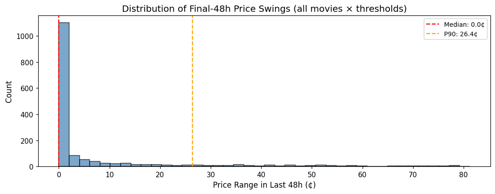
    


## 8. Data quality check

Cross-check: does the reviews.csv review count match the movies_index range? Any movies with suspicious gaps?


```python
# Cross-check review counts
xcheck = mi[['Slug', 'reviews_low', 'reviews_high', 'reviews_mid']].merge(
    rev_counts[['movie_slug', 'n_reviews']], 
    left_on='Slug', right_on='movie_slug', how='outer'
)

# Movies in index but not in reviews
missing_reviews = xcheck[xcheck['n_reviews'].isna()]
if not missing_reviews.empty:
    print(f"Movies in index but missing from reviews.csv: {len(missing_reviews)}")
    print(missing_reviews['Slug'].tolist())

# Movies in reviews but not in index
extra_reviews = xcheck[xcheck['Slug'].isna()]
if not extra_reviews.empty:
    print(f"\nMovies in reviews.csv but not in index: {len(extra_reviews)}")
    print(extra_reviews['movie_slug'].tolist())

# Review count comparison
xcheck = xcheck.dropna(subset=['Slug', 'n_reviews'])
xcheck['in_range'] = (xcheck['n_reviews'] >= xcheck['reviews_low']) & (xcheck['n_reviews'] <= xcheck['reviews_high'])
# Reviews.csv has ALL reviews (including post-close), index has bet-close counts
# So reviews.csv count should be >= the high end of the range
xcheck['above_range'] = xcheck['n_reviews'] > xcheck['reviews_high']

print(f"\nReview count vs index range:")
print(f"  DB count within index range: {xcheck['in_range'].sum()}")
print(f"  DB count above index range (post-close reviews): {xcheck['above_range'].sum()}")
print(f"  DB count below index low: {(xcheck['n_reviews'] < xcheck['reviews_low']).sum()}")

# Show movies where DB has fewer reviews than index range (data gap)
low = xcheck[xcheck['n_reviews'] < xcheck['reviews_low']].sort_values('n_reviews')
if not low.empty:
    print(f"\nMovies with FEWER DB reviews than index range (potential data gap):")
    display(low[['Slug', 'n_reviews', 'reviews_low', 'reviews_high']].head(10))

# Timestamp confidence distribution
print(f"\nTimestamp confidence breakdown:")
print(reviews['timestamp_confidence'].value_counts())
```

    
    Movies in reviews.csv but not in index: 2
    ['the_drama', 'the_super_mario_galaxy_movie']
    
    Review count vs index range:
      DB count within index range: 136
      DB count above index range (post-close reviews): 4
      DB count below index low: 0
    
    Timestamp confidence breakdown:
    timestamp_confidence
    d    22901
    m      414
    h      101
    Name: count, dtype: int64


```python

```
